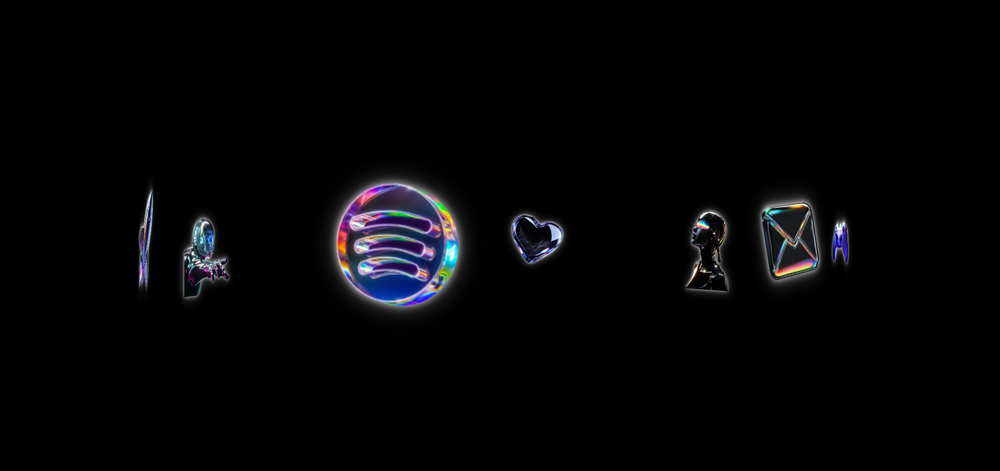

# 🌐 Orbital Animation

> **My First CSS Animation Project**

This is my first project in my journey of learning **CSS animations**.

I wanted to understand how far I could go with CSS alone, especially when it comes to **3D transformations and continuous motion**.

For this project, I created a 3D orbital/carousel effect where multiple images are positioned around an invisible circular axis and continuously rotate in 3D space.

No JavaScript was used for the animation.

---

## 🎥 Project Preview

### Screenshot


> 📌 Add a screenshot of your project inside a `screenshots` folder.

For example:

```text
project/
│
├── index.html
├── style.css
├── screenshots/
│   └── orbital-animation.png
└── README.md
```

---

# ✨ What Does This Project Do?

The project places **8 images around a 3D circular structure**.

Each image is rotated around the Y-axis and pushed away from the center using `translateZ()`.

Then the entire carousel continuously rotates using a CSS `@keyframes` animation.

The result looks like a 3D orbital carousel:

```text
                 🖼️
           🖼️         🖼️

      🖼️        ●        🖼️

           🖼️         🖼️
                 🖼️
```

The important thing is that the images aren't actually moving individually.

Instead, they are positioned in **3D space**, and the parent container rotates.

---

# 🧠 Main CSS Concepts I Learned

This project helped me understand several important CSS animation concepts:

* `perspective`
* `transform-style: preserve-3d`
* `rotateY()`
* `translateZ()`
* `transform`
* `@keyframes`
* `animation`
* `position: absolute`
* `nth-child()`
* `linear`
* `infinite`
* 3D positioning

These concepts are the main reason I built this project.

---

# 🎭 1. Creating the 3D Scene

The first important part is creating a perspective for the scene.

```css
.crousel-scene {
    height: 100vh;
    width: 100%;
    perspective: 1300px;
}
```

The important property here is:

```css
perspective: 1300px;
```

### What does `perspective` do?

Perspective controls how the browser renders objects in 3D space.

You can think of it as controlling the distance between the viewer and the 3D scene.

A smaller perspective can make the 3D effect feel stronger.

A larger perspective makes the scene feel flatter.

In this project, I used:

```css
perspective: 1300px;
```

to create a visible but smooth 3D effect.

---

# 🧊 2. Preserving 3D Space

The carousel itself uses:

```css
.crousel {
    height: 100%;
    width: 100%;
    display: flex;
    align-items: center;
    justify-content: center;
    position: relative;

    transform-style: preserve-3d;

    animation: spin 15s linear infinite;
}
```

The important property is:

```css
transform-style: preserve-3d;
```

Without this, the child elements may not behave as expected in 3D space.

This tells the browser that the children of `.crousel` should maintain their 3D positioning.

---

# 🔄 3. Positioning the Images in a Circle

This is probably the most important part of the project.

Each image is positioned using:

```css
rotateY()
```

and

```css
translateZ()
```

For example:

```css
.crousel-item:nth-child(1) {
    transform: rotateY(0deg) translateZ(600px);
}
```

The next image:

```css
.crousel-item:nth-child(2) {
    transform: rotateY(45deg) translateZ(600px);
}
```

Then:

```css
.crousel-item:nth-child(3) {
    transform: rotateY(90deg) translateZ(600px);
}
```

And the pattern continues:

```text
0°
45°
90°
135°
180°
225°
270°
315°
```

There are 8 images, so I divide the full `360°` circle into 8 equal sections.

### The calculation

```text
360° ÷ 8 = 45°
```

That's why each item is separated by `45deg`.

---

# 📐 4. Understanding `translateZ()`

Every carousel item has:

```css
translateZ(600px)
```

For example:

```css
transform: rotateY(90deg) translateZ(600px);
```

`translateZ()` moves an element forward or backward along the Z-axis.

In this project, `600px` acts like the **radius of the carousel**.

A larger value:

```css
translateZ(800px);
```

would make the circle larger.

A smaller value:

```css
translateZ(400px);
```

would make the circle smaller.

So this single value gives me control over the size of the orbital path.

---

# 🌀 5. Rotating the Whole Carousel

Instead of individually animating all 8 images, I animate the parent container.

```css
@keyframes spin {
    from {
        transform: rotateY(0);
    }

    to {
        transform: rotateY(360deg);
    }
}
```

Then:

```css
.crousel {
    animation: spin 15s linear infinite;
}
```

This means:

```text
0° → 360°
```

and then it starts again.

The animation runs for:

```text
15 seconds
```

and repeats forever because of:

```css
infinite
```

---

# ⏱️ 6. Why `linear`?

I used:

```css
animation: spin 15s linear infinite;
```

The `linear` timing function means the animation maintains a constant speed.

Without it, the animation could accelerate and decelerate depending on the timing function.

For an orbital rotation, `linear` makes the movement feel continuous and mechanical.

---

# 🖼️ 7. Image Styling

The images use:

```css
.crousel-item img {
    height: 100%;
    width: 100%;
    object-fit: contain;
}
```

I used `object-fit: contain` because the images have different shapes and transparent backgrounds.

This allows the images to fit inside their containers without being unnecessarily cropped.

---

# ✨ 8. Adding a Glow Effect

I also added a small glow around the images using `drop-shadow()`.

```css
filter:
    drop-shadow(0 0 4px rgba(255, 255, 255, 0.8))
    drop-shadow(0 0 12px rgba(255, 255, 255, 0.35));
```

This creates a subtle glowing effect around the transparent images.

It also makes the objects stand out against the black background.

---

# 🧩 How Everything Works Together

The animation can be understood in a few layers.

### Layer 1 — Scene

```css
.crousel-scene {
    perspective: 1300px;
}
```

Creates the 3D viewing environment.

↓

### Layer 2 — Carousel

```css
.crousel {
    transform-style: preserve-3d;
    animation: spin 15s linear infinite;
}
```

Creates the 3D object and rotates it.

↓

### Layer 3 — Items

```css
.crousel-item {
    position: absolute;
}
```

Allows the images to be positioned around the same center.

↓

### Layer 4 — 3D Position

```css
rotateY(...)
translateZ(600px)
```

Places each image around the circular path.

↓

### Layer 5 — Animation

```css
@keyframes spin
```

Rotates the entire structure continuously.

---

# 📊 The 8 Positions

| Image | Rotation |
| ----- | -------: |
| 1     |   `0deg` |
| 2     |  `45deg` |
| 3     |  `90deg` |
| 4     | `135deg` |
| 5     | `180deg` |
| 6     | `225deg` |
| 7     | `270deg` |
| 8     | `315deg` |

Each image also uses:

```css
translateZ(600px)
```

So together they form the 3D ring.

---

# 🛠️ Technologies Used

* HTML5
* CSS3
* CSS 3D Transforms
* CSS Animations
* `@keyframes`
* `perspective`
* `transform-style`
* `rotateY()`
* `translateZ()`
* CSS Filters

### JavaScript

**None.**

The entire animation is created using HTML and CSS.

---

# 📸 Screenshots

## Main Animation




> Add screenshots here as you continue experimenting with the project.

---

# 💡 What I Learned

This project was my first real experiment with **CSS 3D animation**.

The biggest thing I learned is that CSS isn't limited to simple things like:

```css
translateX()
```

or:

```css
scale()
```

CSS can also create surprisingly complex 3D effects using a combination of:

```css
perspective
+
transform-style
+
rotateY
+
translateZ
+
@keyframes
```

The most interesting part for me was understanding that I don't need to animate every element individually.

I can create a 3D structure first and then animate the **parent container**.

---

# 🧪 Things I Want to Experiment With Next

There are still many things I want to improve in this project.

Some ideas:

* Make the carousel responsive
* Change the radius dynamically
* Add hover interactions
* Pause the animation on hover
* Make the carousel rotate based on mouse movement
* Experiment with `rotateX()`
* Add depth-based scaling
* Add reflections
* Experiment with different perspectives
* Try making the carousel interactive with JavaScript
* Recreate the effect using GSAP

---

# 🌱 My Animation Journey

This project is **Project #01** in my CSS animation learning journey.

I'm keeping my animation experiments in a separate repository so I can come back later and see how much I've improved.

This project isn't meant to be a perfect production-ready component.

It's a learning project.

The goal is to understand **why the animation works**, not just copy the final code.

> **Project #01 — Orbital CSS Animation 🚀**

---

## ⭐ Final Thought

One small project at a time.

One animation at a time.

One new CSS property at a time.

**This is where my animation journey begins.**
