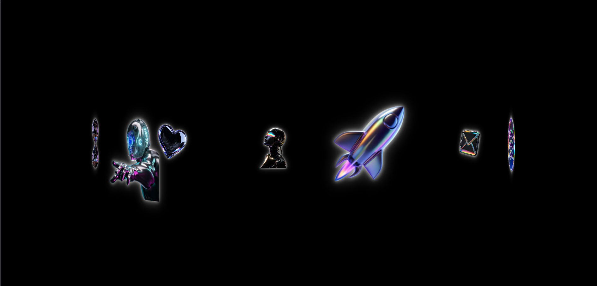

# 🎨 CSS Animation — My First Project

> **My first project while learning CSS animations.**

This project is part of my journey of learning **web animations and creative frontend development using CSS**.

The goal of this project was to understand how CSS can be used to create smooth, interactive, and visually engaging animations without relying on JavaScript animation libraries.

This is my **first CSS animation project**, and I'm using it to experiment with concepts like `@keyframes`, `transform`, `transition`, `scale`, hover animations, `cubic-bezier`, and infinite animations.

---

## 🚀 Project Preview



Add a screenshot of your project here:

```md

```

> 📌 Replace the path above with the actual location of your screenshot.

---

## 🎯 What I Wanted to Learn

For this first project, I focused on understanding:

* CSS `@keyframes`
* `transform`
* `translateY()`
* `translateX()`
* `scale()`
* CSS `transition`
* Hover animations
* Infinite animations
* `cubic-bezier()` timing functions
* Animation duration
* `ease-out` and `linear`
* Image animations
* Text entrance animations
* Creating a continuous marquee effect
* Combining multiple animations on a webpage

---

# ✨ Animations Used

## 1. Landing Image Animation

One of the first animations I experimented with was animating an image from a larger scale back to its normal size.

```css
@keyframes landing-page-animation {
    from {
        scale: 1.8;
    }

    to {
        scale: 1;
    }
}
```

The animation starts with the image at `1.8x` its original size and smoothly brings it back to its normal size.

I used:

```css
animation: landing-page-animation 1.5s
    cubic-bezier(0.165, 0.84, 0.44, 1);
```

### What I learned

This helped me understand how `@keyframes` can control an animation from a starting state to an ending state.

---

# 2. Text Entrance Animation

I also experimented with bringing text onto the screen from below.

```css
@keyframes landing-text-animation {
    from {
        transform: translateY(120%);
    }

    to {
        transform: translateY(0);
    }
}
```

The text starts below its normal position and moves upward into place.

This was one of the most useful animations for me because the same technique can be used for:

* Hero headings
* Navigation elements
* Page transitions
* Cards
* Section titles

---

# 3. Fade-In Animation

For smaller text elements, I used a simple opacity animation.

```css
@keyframes landing-para-animation {
    from {
        opacity: 0;
    }

    to {
        opacity: 1;
    }
}
```

This creates a simple **fade-in effect**.

```css
animation: landing-para-animation 1.8s ease-out;
```

### Concept

`opacity: 0`

→ element is invisible

`opacity: 1`

→ element becomes completely visible

This was my introduction to combining **animation + timing functions**.

---

# 4. Hover Image Zoom

I used CSS transitions to create an image zoom effect when hovering over an image.

```css
.footer-img-div img {
    transition: all 0.6s cubic-bezier(0.165, 0.84, 0.44, 1);
}

.footer-img-div:hover img {
    scale: 1.25;
}
```

When the user hovers over the image, it scales to `1.25`.

The important part here is:

```css
transition: all 0.6s;
```

Unlike `@keyframes`, this animation happens when a property changes, such as during `:hover`.

---

# 5. Image Saturation Animation

I also experimented with changing the saturation of an image.

Initially:

```css
filter: saturate(0);
```

On hover:

```css
filter: saturate(100%);
```

So the image starts almost grayscale and becomes colorful when hovered.

```css
.footer-img-div:hover img {
    scale: 1.25;
    filter: saturate(100%);
}
```

This taught me that CSS animations aren't limited to movement.

I can animate things like:

* Scale
* Position
* Opacity
* Filters
* Colors
* Transformations

---

# 6. List Hover Animation

For the list section, I experimented with moving images vertically.

Initially:

```css
.list-img img {
    transform: translateY(120%);
}
```

When the parent element is hovered:

```css
.list-div:hover .list-img img {
    transform: translateY(0%);
}
```

This creates a reveal effect where the images move upward into view.

I really liked this technique because it makes a normal list feel much more interactive.

---

# 7. Navigation Hover Animation

I also experimented with pseudo-elements.

```css
.nav-link::before {
    content: "";
    height: 10%;
    width: 0.7vw;
    transition: width 0.2s ease-out;
    background-color: whitesmoke;
}
```

On hover:

```css
.nav-link:hover::before {
    width: 2vw;
}
```

This creates a small animated indicator beside the navigation item.

### What I learned

Pseudo-elements such as:

```css
::before
::after
```

can also be animated.

This opened up a lot of possibilities for creating UI animations without adding extra HTML elements.

---

# 8. Infinite Marquee Animation

One of the most interesting things I experimented with was creating a continuously moving image track.

```css
@keyframes marque-animation {
    from {
        transform: translateX(0);
    }

    to {
        transform: translateX(-100%);
    }
}
```

Then:

```css
.marque-track {
    animation: marque-animation 7s linear infinite;
}
```

The important part is:

```css
infinite
```

Instead of stopping after one animation cycle, the animation keeps repeating.

And:

```css
linear
```

keeps the movement at a constant speed.

This helped me understand how CSS can create **continuous motion**.

---

# 🧠 CSS Concepts I Learned

## `@keyframes`

`@keyframes` allows me to define the different stages of an animation.

Example:

```css
@keyframes example {
    from {
        transform: translateY(100%);
    }

    to {
        transform: translateY(0);
    }
}
```

Then I can use it with:

```css
animation: example 1s ease-out;
```

---

## `transform`

I used transforms heavily throughout this project.

Some examples:

```css
translateY()
translateX()
scale()
```

Transforms are extremely useful for animations because they allow elements to move and scale without changing their normal layout flow.

---

## `transition`

I used transitions for interactions such as hover effects.

```css
transition: transform 0.5s ease;
```

Instead of instantly changing from one state to another, CSS smoothly interpolates between the two states.

---

## `cubic-bezier()`

I also started experimenting with custom timing functions.

For example:

```css
cubic-bezier(0.165, 0.84, 0.44, 1)
```

This controls **how the animation accelerates and decelerates**.

This was an important discovery for me because the same animation can feel completely different depending on its timing function.

---

# 🆚 `transition` vs `animation`

One thing I learned from this project is the difference between transitions and keyframe animations.

### Transition

Usually useful for interaction:

```css
.element {
    transition: transform 0.5s ease;
}

.element:hover {
    transform: scale(1.2);
}
```

### Animation

Useful when I want more control over the animation timeline:

```css
@keyframes move {
    from {
        transform: translateX(0);
    }

    to {
        transform: translateX(-100%);
    }
}

.element {
    animation: move 7s linear infinite;
}
```

---

# 🛠️ Technologies Used

* HTML5
* CSS3
* CSS Animations
* CSS Transforms
* CSS Transitions
* CSS Filters
* Google Fonts

No JavaScript animation library was used for the animations.

---

# 📸 Screenshots

## Main View


## Hover Animation


## Marquee Animation


> Add your actual screenshots inside a `screenshots` folder and update these paths if necessary.

---

# 📚 What I Learned From This Project

This project was more than just creating a webpage for me.

It was my first real step into understanding **motion on the web**.

Before this project, CSS animations felt like something I could copy from tutorials.

While building this, I started understanding:

* How animations are structured
* How transforms work
* How timing functions change the feel of an animation
* How hover states can create interaction
* How to create continuous animations
* How to combine multiple animations on one page
* How small animations can make a website feel more alive

I still have a lot to learn, but this project gave me a starting point.

---

# 🧪 Things I Want to Explore Next

This is only the beginning of my animation journey.

Next, I want to explore:

* More advanced `cubic-bezier()` curves
* CSS 3D transforms
* `perspective`
* `rotateX()`, `rotateY()` and `rotateZ()`
* Scroll-based animations
* Intersection Observer
* SVG animations
* Advanced image reveal animations
* Text animations
* GSAP
* Framer Motion
* WebGL / Three.js
* Combining CSS and JavaScript for more complex interactions

---

# 🌱 My Animation Learning Journey

This project is my **first step into CSS animation**.

I am keeping my animation projects in a separate repository so I can look back at my progress over time.

The goal isn't to make every project perfect.

The goal is to **build, experiment, understand, and improve with every project.**

> **Project 01 — First step into CSS animation 🚀**

---

## ⭐ If You Like It

If you find the animation interesting, feel free to explore the code and experiment with it yourself.

More animation experiments will be added as I continue learning.
