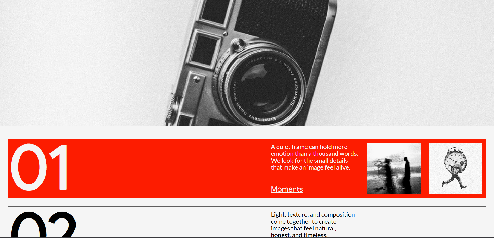
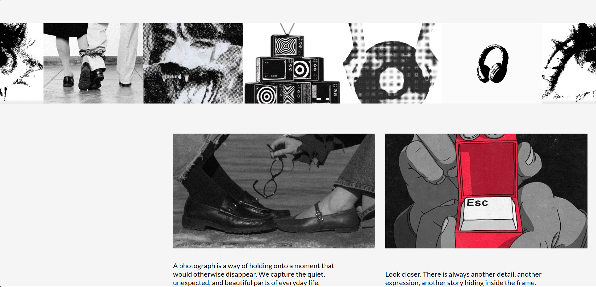

# 📸 Photography — Visual Stories

> **A photography-inspired landing page built while learning CSS animations and interactions.**

This project is part of my journey of learning **CSS animation and creative frontend development**.

Instead of focusing only on making a page look good, I wanted to understand how motion can be used to make a website feel more alive.

For this project, I experimented with **entrance animations, hover interactions, image reveals, scaling effects, color transitions, filters, and an infinite marquee animation**.

The page is designed around a photography/visual storytelling theme, with sections for **Moments, Frame, Perspective, Emotion, and Stories**.

---

# 🎥 Project Preview

## Screenshot



> Add your project screenshot inside the `screenshots` folder.

Example:

```text
project/
│
├── index.html
├── style.css
├── screenshots/
│   └── project-preview.png
└── README.md
```

---

# 🎯 What Was I Trying to Learn?

This project was mainly about understanding how different CSS animation techniques can work together to create a complete interactive webpage.

I experimented with:

* `@keyframes`
* `transform`
* `scale`
* `translateY()`
* `translateX()`
* `opacity`
* `filter`
* `transition`
* `animation`
* `cubic-bezier()`
* `:hover`
* `::before`
* `infinite` animations
* `linear` timing
* Image reveal animations
* Text entrance animations

---

# ✨ Animations & Interactions

## 1. Hero Image Scale Animation

The main image starts larger than its normal size and smoothly scales down when the page loads.

```css
@keyframes landing-page-animation {
    from {
        scale: 1.8;
    }

    to {
        scale: 1;
    }
}
```

The animation is applied to the hero image:

```css
.bottom-section img {
    animation: landing-page-animation 1.5s
        cubic-bezier(0.165, 0.84, 0.44, 1);
}
```

### What I learned

This was one of my first experiments with using `scale` inside `@keyframes`.

The idea is simple:

```text
1.8x
 ↓
1.0x
```

Instead of the image appearing at its final size immediately, it feels like the image is settling into the page.

---

# 📝 2. Hero Heading Reveal

The large **"Capture"** heading uses a vertical reveal animation.

```css
@keyframes landing-text-animation {
    from {
        transform: translateY(120%);
    }

    to {
        transform: translateY(0);
    }
}
```

The heading starts below its final position:

```css
transform: translateY(120%);
```

and moves upward until it reaches:

```css
transform: translateY(0);
```

The animation is:

```css
animation: landing-text-animation 1.5s
    cubic-bezier(0.165, 0.84, 0.44, 1);
```

### Why I liked this effect

This technique can be used for:

* Hero headings
* Section titles
* Page transitions
* Navigation
* Text reveals

It is a simple animation, but it makes the page feel much more dynamic.

---

# 🌫️ 3. Paragraph Fade-In

The navigation paragraphs use an opacity animation.

```css
@keyframes landing-para-animation {
    from {
        opacity: 0;
    }

    to {
        opacity: 1;
    }
}
```

The animation runs for:

```css
animation: landing-para-animation 1.8s ease-out;
```

So the text goes from:

```text
opacity: 0
     ↓
opacity: 1
```

This creates a simple fade-in effect.

---

# ➡️ 4. Navigation Hover Animation

I used a pseudo-element on the navigation links.

```css
.nav-link::before {
    content: "";
    height: 10%;
    width: 0.7vw;
    transition: width 0.2s ease-out;
    background-color: whitesmoke;
}
```

When the user hovers over the navigation link:

```css
.nav-link:hover::before {
    width: 2vw;
}
```

The small indicator becomes wider.

### What I learned

This showed me that I can create animated UI elements without adding another HTML element.

The `::before` pseudo-element becomes part of the interaction.

---

# 🖼️ 5. List Image Reveal

The list section contains multiple photography categories.

For example:

```text
01 — Moments
02 — Frame
03 — Perspective
04 — Emotion
05 — Stories
```

The HTML structures these as individual `.list-div` sections.

The images initially sit below their visible position:

```css
.list-img img {
    transform: translateY(120%);
    transition: transform 0.37s
        cubic-bezier(0.445, 0.05, 0.55, 0.95);
}
```

When the list item is hovered:

```css
.list-div:hover .list-img img {
    transform: translateY(0%);
}
```

So the interaction becomes:

```text
Image hidden
     ↓
Hover
     ↓
Image moves upward
     ↓
Image becomes visible
```

This is one of the main interactions in the project.

---

# 🔴 6. List Background Color Transition

The entire list item also changes color when hovered.

```css
.list-div {
    transition: all 0.9s
        cubic-bezier(0.19, 1, 0.22, 1);
}
```

On hover:

```css
.list-div:hover {
    background-color: #fd1c00;
    color: whitesmoke;
}
```

So the interaction combines:

* Background color
* Text color
* Image movement

into a single hover experience.

This taught me that multiple CSS properties can transition together.

---

# 🔁 7. Infinite Marquee Animation

One of the most interesting animations in this project is the horizontal image marquee.

The animation is defined using:

```css
@keyframes marque-animation {
    from {
        transform: translateX(0);
    }

    to {
        transform: translateX(-100%);
    }
}
```

Then applied to the track:

```css
.marque-track {
    animation: marque-animation 7s linear infinite;
}
```

The important parts are:

```text
7s
linear
infinite
```

### `7s`

Controls how long one animation cycle takes.

### `linear`

Keeps the movement at a constant speed.

### `infinite`

Makes the animation continue forever.

The HTML contains two marquee tracks, each containing a series of photography images.

---

# 🖤 8. Footer Image Reveal

The footer images initially have:

```css
filter: saturate(0);
```

This makes them appear desaturated.

They also have a transition:

```css
transition: all 0.6s
    cubic-bezier(0.165, 0.84, 0.44, 1);
```

When hovered:

```css
.footer-img-div:hover img {
    scale: 1.25;
    filter: saturate(100%);
}
```

So two things happen simultaneously:

```text
Grayscale
   +
Normal scale

       ↓ Hover

Color
   +
1.25x scale
```

This creates a more noticeable interaction without needing JavaScript.

The footer contains two photography/image blocks followed by the large **Capture** heading.

---

# 🎨 9. Footer Heading Color Transition

The final **Capture** heading also has a hover interaction.

```css
.footer-bottom h2 {
    transition: color 0.5s
        cubic-bezier(0.165, 0.84, 0.44, 1);
}
```

On hover:

```css
.footer-bottom h2:hover {
    color: #fd1c00;
}
```

It's a very small animation, but it demonstrates an important concept:

> Not every animation needs movement.

A simple color transition can also create interaction.

---

# 🧠 `@keyframes` vs `transition`

One of the main things I learned from this project was the difference between these two approaches.

## `@keyframes`

I used `@keyframes` for animations that should happen automatically when the page loads or continuously.

Examples:

```css
landing-page-animation
landing-text-animation
landing-para-animation
marque-animation
```

For example:

```css
@keyframes landing-text-animation {
    from {
        transform: translateY(120%);
    }

    to {
        transform: translateY(0);
    }
}
```

---

## `transition`

I used `transition` mainly for user interactions.

For example:

```css
.footer-img-div img {
    transition: all 0.6s ease;
}
```

Then:

```css
.footer-img-div:hover img {
    scale: 1.25;
}
```

The transition makes the change smooth when the user moves the cursor over the element.

---

# ⏱️ Exploring `cubic-bezier()`

Another important part of this project was experimenting with custom easing.

Instead of only using:

```css
ease
ease-in
ease-out
linear
```

I experimented with values such as:

```css
cubic-bezier(0.165, 0.84, 0.44, 1)
```

and:

```css
cubic-bezier(0.19, 1, 0.22, 1)
```

and:

```css
cubic-bezier(0.445, 0.05, 0.55, 0.95)
```

This helped me understand that **timing is a huge part of how an animation feels**.

The same movement can feel:

* slow
* fast
* smooth
* sharp
* elastic
* natural

depending on the easing function.

---

# 🔤 Fonts

I also experimented with Google Fonts.

The project imports:

* Google Sans
* Lato

```css
@import url('https://fonts.googleapis.com/css2?family=Google+Sans:ital,opsz,wght@0,17..18,400..700;1,17..18,400..700&family=Lato:ital,wght@0,100..900;1,100..900&display=swap');
```

I used Google Sans primarily for headings and Lato for paragraph/body content.

This helped me understand how typography contributes to the overall visual feel of an animation-focused webpage.

---

# 🧩 How the Animation System Works

The project can be thought of as several layers.

### Hero Section

```text
Page loads
    ↓
Image scales down
    ↓
Heading slides upward
    ↓
Paragraph fades in
```

### Navigation

```text
Hover
   ↓
Pseudo-element expands
```

### Photography List

```text
Hover
   ↓
Background changes
   ↓
Text changes color
   ↓
Images slide upward
```

### Marquee

```text
Image track
   ↓
translateX()
   ↓
continuous movement
   ↓
infinite loop
```

### Footer

```text
Hover image
   ↓
Image scales
   ↓
Saturation increases
```

and:

```text
Hover "Capture"
   ↓
Text color changes
```

---

# 🛠️ Technologies Used

* HTML5
* CSS3
* CSS Animations
* CSS Transitions
* CSS Transforms
* CSS Filters
* CSS Pseudo-elements
* Google Fonts
* `cubic-bezier()`

### JavaScript

**None.**

All the animations and interactions in this project are created with CSS.

---

# 📸 Screenshots

## Hero Section


## List Hover Animation


## Marquee


## Footer Interaction


> Replace these paths with your actual screenshots.

---

# 📚 What I Learned

This project taught me that animation isn't just about making things move.

Good animation can help communicate:

* hierarchy
* interaction
* focus
* transitions
* visual storytelling

The biggest things I learned were:

* How `@keyframes` works
* How `transition` works
* How to animate `transform`
* How `translateY()` can create reveal effects
* How `scale()` can create depth
* How `opacity` can create entrance animations
* How CSS filters can be animated
* How pseudo-elements can be interactive
* How to create an infinite marquee
* How easing affects the feeling of motion
* How multiple small animations can work together

---

# 🤔 What I Found Interesting

The most interesting part of this project was seeing how much interaction can be created **without JavaScript**.

For example, this:

```css
.list-div:hover .list-img img {
    transform: translateY(0%);
}
```

combined with:

```css
.list-div:hover {
    background-color: #fd1c00;
}
```

is enough to turn a static list into an interactive section.

That made me realize that CSS itself is a powerful tool for creating motion.

---

# 🧪 What I Want to Learn Next

After this project, I want to explore more advanced animation techniques:

* Better responsive animations
* Scroll-based animations
* `IntersectionObserver`
* CSS 3D transforms
* More advanced image reveals
* Text splitting animations
* SVG animations
* Mouse-follow animations
* GSAP
* ScrollTrigger
* More advanced easing
* Combining CSS with JavaScript

---

# 🌱 My Animation Journey

This project is another step in my journey of learning animation.

I'm keeping these projects separate so I can experiment freely and look back at my progress later.

I'm not trying to build everything perfectly from the beginning.

I'm trying to understand:

> **How does the animation work?**

> **Why does it feel good?**

> **What happens if I change this value?**

That experimentation is the main reason I'm building these projects.

---

## 🚀 Project Goal

The goal of this project was simple:

**Take a static photography website and make it feel alive using CSS.**

From the first page-load animation to the hover interactions and continuous marquee, every animation was an experiment in understanding CSS motion.

> **Project — Photography / Visual Stories 📸**
>
> *Learning animation one interaction at a time.*
